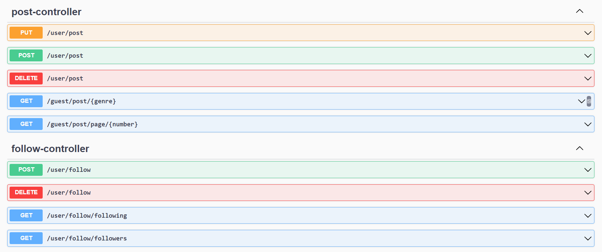
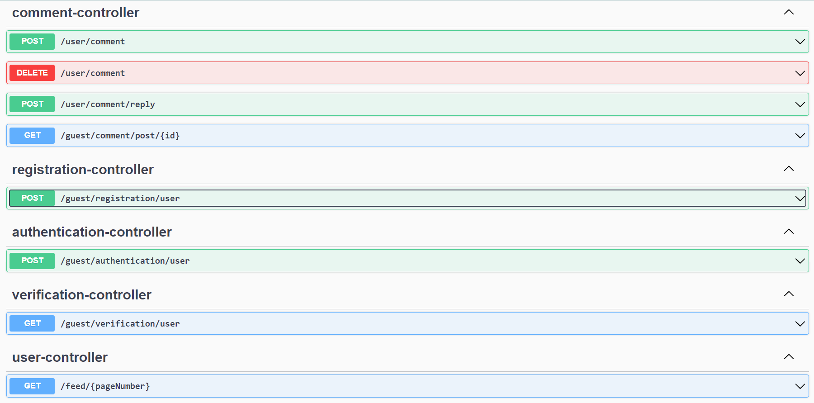
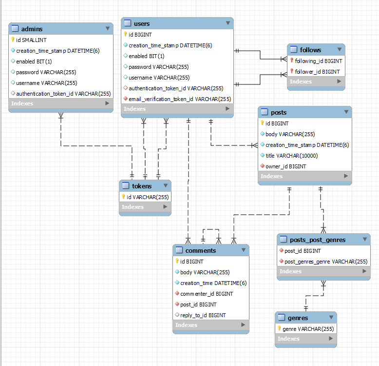

# Scribble Space
Complete blog api.

***

## Framework and Languages
* Java Platform 8
* JDK 17
* Maven
* SpringBoot starter web - ver. 1.3.6

## Data Flow
This section outlines implementation of the layers.
## Entity

#### ApplicationUser : 
 * contains basic authentication data for registered users
#### Admin :
 * test class reserved for future use
#### Post :
 * contains post data and connection to the user who has posted
#### Comment :
* contains comment data, connection to the user who has posted and can be a reply to a previous comment
#### Follow :
* A relationship between 2 users wherein the follower starts seeing the other person on his feed
#### Token :
* Simple UUID string token

 ## Controller
   Complete Controller Documentation can be viewed on the swagger ui for best experience: http://3.110.191.185/swagger-ui/index.html#/

## Services

In addition to services made for all the entities for CRUD operations, There are:

* Mailing Service
* Guest Service
* Authentication Service
  

## Repository
     JpaRepository, all write functions are transactional.
## DataBase Design
 MySQL database. The full ERD diagram is attached below for reference
 

